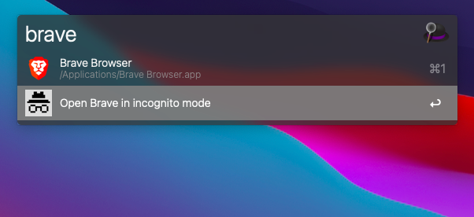

# alfred-incognito-browser


> [Alfred 3](https://www.alfredapp.com) workflow to open chosen browser in incognito/private mode

## Install

```
$ npm install --global alfred-incognito-browser
```

_Requires [Node.js](https://nodejs.org) 12+ and the Alfred [Powerpack](https://www.alfredapp.com/powerpack/)._

## Usage

### Option 1

Type `incognito` to get the list of available browsers. Select one and press <kbd>Enter</kbd>.


### Option 2

Type `<browser name>` select new option and press <kbd>Enter</kbd>.



## Contribution

Do you miss your favorite browser? Just create an issue or add it to the `browserList.json` and create a pull request.

## Available Browsers

- Brave
- Chrome
- Chrome Dev
- Edge
- Firefox
- Firefox Developer Edition
- Opera
- Safari
